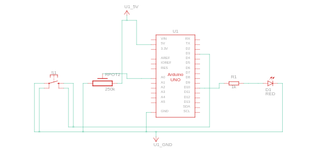
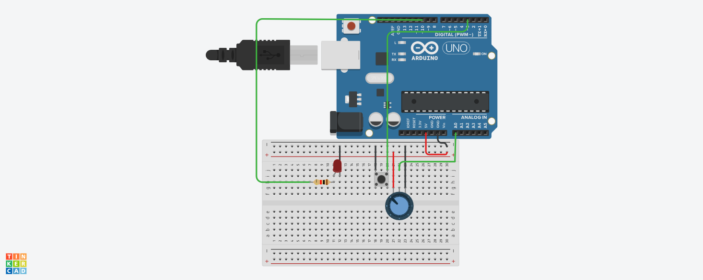

# Dimmable Touch Lamp using Arduino

This project simulates a touch-activated dimmable LED lamp. A button toggles the LED ON/OFF, and a potentiometer adjusts the brightness using PWM. Designed as part of my Embedded Systems learning journey (Week 5 mini project).

## 🔧 Components Used

- Arduino UNO
- 1x Push-button (using internal pull-up)
- 1x LED
- 1x 220Ω resistor
- 1x Potentiometer
- Breadboard and jumper wires

## 🔌 Circuit Connections

### Button:
- One leg to digital pin 3
- Other leg to GND
- Configured with `INPUT_PULLUP` in code (no external resistor needed)

### LED:
- Long leg (anode) to pin 10 via 220Ω resistor
- Short leg (cathode) to GND

### Potentiometer:
- One terminal to 5V
- Wiper (middle) to A0
- Other terminal to GND
  
## 🔌 Circuit Diagram




## 📄 Code Example

```cpp
int led=10;
int p=A0;
int button =3;
int val;
int state=0;
void setup()
{
  pinMode(led, state);
  pinMode(button,INPUT_PULLUP);
  
}

void loop(){
  if(digitalRead(button)==HIGH){
 val=analogRead(p);
  val=map(val,0,1023,0,255);
    analogWrite(led,val);}
     else{
       analogWrite(led,0);
     }
  delay(10);
}
```


## 📄 Features

- Press button to toggle LED ON or OFF
- Adjust LED brightness using the potentiometer
- Uses PWM via pin 3 and analogRead from A0
- Serial monitor shows brightness value

## 📂 File List

- `dimmable_touch_lamp.ino` — Arduino source code
- `circuit_diagram.png` — Optional circuit image (Tinkercad or hand-drawn)
- `README.md` — This project documentation

## 🛠️ Built With

- Arduino UNO
- Arduino IDE 
- Tinkercad
- Breadboard prototyping

## ✍️ Author

Manoj Kumar  
GitHub: [manoj-ecedev](https://github.com/-ecedev)  


---

